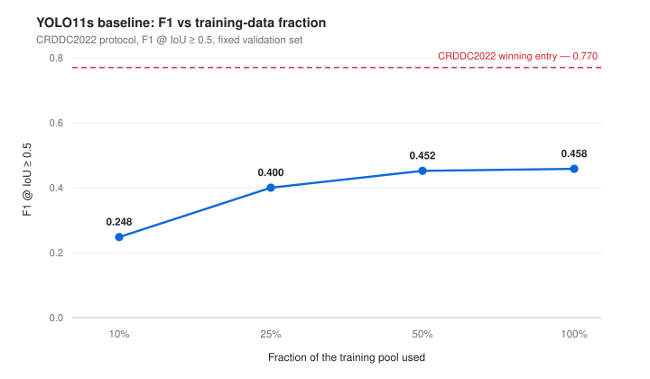

# Road Damage Detection System (RDDS)

An end-to-end deep learning pipeline that detects four classes of road surface
damage in street-level imagery, trained on RDD2022 and evaluated under the
official CRDDC2022 protocol (F1 at IoU ≥ 0.5).

The repository covers the whole lifecycle, not just the model: dataset
conversion and stratified splitting, training with experiment tracking,
protocol-faithful evaluation, inference on images and video, and a controlled
retraining loop that promotes a new model to production only when it beats the
incumbent by a defined margin.



## Results

All three rows are measured on the same fixed validation set under the same
CRDDC2022 protocol, so the comparison is like-for-like.

| Model | F1 @ IoU ≥ 0.5 | mAP@0.5 |
| --- | --- | --- |
| YOLO11s baseline, 100 % of the training pool | 0.458 | 0.596 |
| Production model — incremental fine-tune of the baseline | **0.493** (+0.035) | 0.601 |
| CRDDC2022 winning entry (Maeda et al., 2022) | 0.770 | not published |

The baseline operates at precision 0.883 and recall 0.309: it is conservative,
and nearly all of its error budget is missed damage rather than false alarms.

Two conclusions. Fine-tuning improves on the baseline by a real but modest
margin, and the remaining distance to the leaderboard is a matter of
architecture rather than more training — the reference entry is an ensemble of
architecturally different detectors, while this is a single vanilla one-stage
model. The data-fraction curve supports that reading: F1 climbs steeply from
10 % to 50 % of the training pool and then flattens, gaining only 0.006 over
the final half of the data.

## Architecture

```
download → validate → convert → analyse → split → ingest
                                                    │
                                                    ▼
                                   train ──► evaluate ──► promote
                                     │                       │
                                     ▼                       ▼
                              retrain (loop)            inference
                                                     (images, video,
                                                      FastAPI demo)
```

Three pieces of infrastructure hold the pipeline together:

- **MongoDB Atlas** is the cross-machine source of truth. Three collections —
  `images_metadata`, `experiments`, `predictions` — record every image, every
  run and every prediction. Exactly one experiment document carries
  `is_production=true` at any instant; promotion flips it inside a transaction,
  so the production pointer is never ambiguous even with concurrent writers.
- **MLflow** tracks per-run metrics and parameters locally on each machine.
- **Backblaze B2** stores `best.pt`, `last.pt`, `best.onnx` and `results.csv`
  for every run, with the URLs written back into the experiment document. Any
  team member can fetch any model version from a URL; no machine has to stay
  online as a checkpoint server.

Design invariants held across every experiment: seed fixed at 42, the test
split always evaluated whole, and the same 1,000 images per country held out
for validation, stratified by dominant damage class. Promotion requires
`F1_new > F1_current + 0.01`; runs inside a ±0.005 noise band are recorded but
not promoted.

Training ran in two phases. Phase 0 sweeps growing fractions of the training
pool (10 / 25 / 50 / 100 %) on laptop-class hardware to validate the pipeline
end to end and map the data-efficiency curve. Phase 1 was designed for a shared
A100 SLURM cluster that never materialised; `scripts/train_cluster.sh` and
`scripts/submit_sweep.sh` remain in the repository as a documented design
artefact, and the YOLO11m run moved to a local RTX 4060 instead.

## Quick start

Requires Python 3.12 and, for training or evaluation, an NVIDIA GPU. Inference
and the web demo fall back to CPU.

```bash
git clone https://github.com/Larriba02/rdds.git && cd rdds
python -m venv .venv && .venv/Scripts/activate   # Linux/macOS: source .venv/bin/activate
pip install -r requirements.txt
cp .env.example .env                             # then fill in MONGO_URI, RDD_DATA_ROOT, Backblaze keys
```

Then run any of:

```bash
python -m src.db.test_connection                 # verify the Atlas connection
python -m src.evaluation.evaluate                # CRDDC2022 evaluation of the production model
streamlit run src/dashboard.py                   # experiment registry dashboard
uvicorn src.api.main:app --reload                # FastAPI detection demo on :8000
```

Training and evaluation default to `device=0`; pass `--device cpu` on a machine
without CUDA. The dataset is not bundled — `python -m src.data.download`
fetches RDD2022 from the Sekilab S3 bucket into `RDD_DATA_ROOT`.

## Project structure

```
src/db/            Atlas connection, collection and index setup, health check
src/data/          download, validate, convert, analyse, split, ingest, upload
src/training/      train, upload_checkpoint, promote, retrain
src/evaluation/    CRDDC2022 evaluation, qualitative inspection, comparison
src/inference/     single-image and video prediction, frame extraction
src/api/           FastAPI web demo
src/dashboard.py   Streamlit experiment registry
tests/             smoke tests + tiny synthetic dataset
scripts/           SLURM submission scripts (documented, not executed)
DOCUMENTATION/     pipeline reference, development log, per-stage guides
```

## Dataset and metric

- **RDD2022** — Sekilab, CC BY-SA 4.0. Four damage classes: longitudinal crack
  (D00), transverse crack (D10), alligator crack (D20) and pothole (D40).
- **CRDDC2022** — the reported metric is F1 at IoU ≥ 0.5, per country and
  overall: https://crddc2022.sekilab.global/overview/. mAP@0.5 on the fixed
  validation set is used during training to select `best.pt` and drive early
  stopping, but it is not the reported figure.

## Team

Group 3, Integrating Project, BSc in Artificial Intelligence Engineering,
Universidad Francisco de Vitoria — June 2026.

- **Marco Larriba** — project lead. Pipeline architecture, data pipeline,
  YOLO11s baseline, evaluation, retraining loop, web demo and overall delivery.
- **Joaquín Abril** — YOLO11m training on local RTX 4060 hardware.
- **David Lázaro** — MongoDB Atlas: cluster, schema and indexes.

## License

Copyright (C) 2026 Marco Larriba, Joaquín Abril, David Lázaro.

Released under the GNU Affero General Public License v3.0 — see
[LICENSE](LICENSE).

AGPL-3.0 was chosen rather than a permissive licence because this project
builds on [Ultralytics](https://github.com/ultralytics/ultralytics) YOLO11,
which is itself AGPL-3.0. That licence is copyleft and extends to combined
works, so a permissive grant on this code would have been misleading. In
practice: you may use, study, modify and redistribute this work, but derived
works must be released under the same licence, and that obligation is
triggered by network use as well as by distribution.

## Documentation

- [`DOCUMENTATION/RDDS_Pipeline.md`](DOCUMENTATION/RDDS_Pipeline.md) — full pipeline reference
- [`DOCUMENTATION/RDDS_Dev_Steps.md`](DOCUMENTATION/RDDS_Dev_Steps.md) — step-by-step development log
- [`DOCUMENTATION/IN DETAIL/`](DOCUMENTATION/IN%20DETAIL/) — one guide per stage:
  [setup](DOCUMENTATION/IN%20DETAIL/setup.md) ·
  [mongo](DOCUMENTATION/IN%20DETAIL/mongo.md) ·
  [data](DOCUMENTATION/IN%20DETAIL/data.md) ·
  [training](DOCUMENTATION/IN%20DETAIL/training.md) ·
  [evaluation](DOCUMENTATION/IN%20DETAIL/evaluation.md) ·
  [inference](DOCUMENTATION/IN%20DETAIL/inference.md) ·
  [dashboard](DOCUMENTATION/IN%20DETAIL/dashboard.md) ·
  [api](DOCUMENTATION/IN%20DETAIL/api.md) ·
  [retraining](DOCUMENTATION/IN%20DETAIL/retraining.md) ·
  [ai_assistance](DOCUMENTATION/IN%20DETAIL/ai_assistance.md)

## AI-assisted development

AI tooling was used as a development assistant for scaffolding, review,
debugging and documentation maintenance. Design decisions, metric choices and
result interpretation are the team's. The policy and its trust boundaries are
documented in
[`DOCUMENTATION/IN DETAIL/ai_assistance.md`](DOCUMENTATION/IN%20DETAIL/ai_assistance.md).
The `CLAUDE.md` and `.claude/` configuration in this repository targets Claude
Code and is inert without it; the codebase runs regardless.
